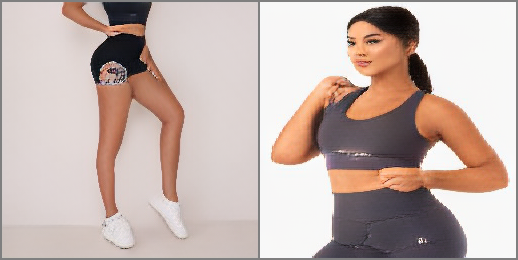
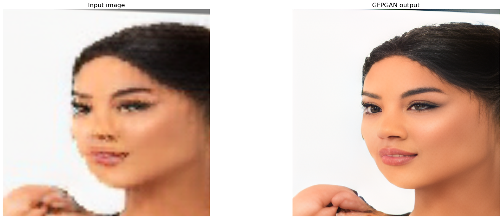
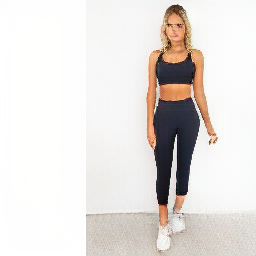
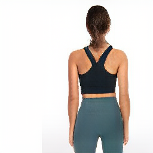
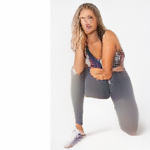
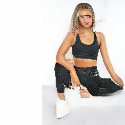
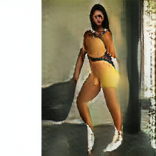
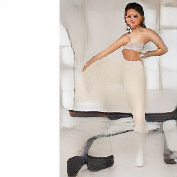

# public_boGAN
The public side of my computer vision projects.  

### adapting VQGAN for conditional human pose generation. 
#### All credits, copyrights go to the original content authors below.
##### contributions so far: 

- gathered 350k-dataset from Webshops using self-built html-crawler
  - created mappings and parser for tags and product infos to construct dataset labels  
  - created proprietary Dataset class to load images, masks, DensePose tensor
  - scripts to create segmentation masks (openCV) from DensePose tensors  

- trained VQGAN and unconditional transformers (very limited by hardware settings) on 30k-sample-dataset (unfiltered)

##### current status:
VQGAN encoder, 19.03.2022 after 60 epochs:

VQGAN encoder, 19.03.2022 after 80 epochs (face reconstruction enhanced):  

superresolution-GAN based GFGAN (adapted to train from low-res VQGAN-reconstructions):  
  

transformer-generated samples, 18.03.22 in epoch 115

**(top_k_250_temp_1.00_top_p_0.5):**

low variation in posture, but definite contours.  
VQGAN does not yet provide adequate codebook for facial reconstruction.

**(top_k_250_temp_1.00_top_p_1.0):**  
higher variation in poses, but less crip results.  

  

autoregressive nature shines through when backgrounds deviate from plain-white.  

  

#### original work: (all credits, licenses, copyrights for the original work go to the original authors)
## Taming Transformers for High-Resolution Image Synthesis
##### CVPR 2021 (Oral)

[**Taming Transformers for High-Resolution Image Synthesis**](https://compvis.github.io/taming-transformers/) 
[Patrick Esser](https://github.com/pesser)\*,
[Robin Rombach](https://github.com/rromb)\*,
[Björn Ommer](https://hci.iwr.uni-heidelberg.de/Staff/bommer) 
\* equal contribution

**tl;dr** We combine the efficiancy of convolutional approaches with the expressivity of transformers by introducing a convolutional VQGAN, which learns a codebook of context-rich visual parts, whose composition is modeled with an autoregressive transformer.

[arXiv](https://arxiv.org/abs/2012.09841) | [BibTeX](#bibtex) | [Project Page](https://compvis.github.io/taming-transformers/)

