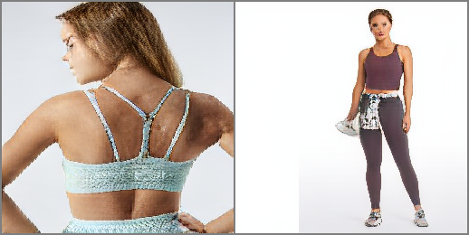
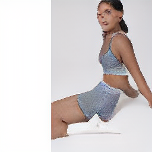

# public boGAN
### adapting VQGAN for conditional human pose generation. 
#### All credits, copyrights go to the original content authors below.  
   

The public side of my computer vision projects. Most of my work branches off public repos, 
and are kept in private. 

##### contributions so far: 

**Dataset**

- gathered **350k**-dataset from Webshops using self-built sitemap-crawler
  - created mappings and parser for tags and product infos to construct dataset labels  
  - created proprietary Dataset class to load images, masks, DensePose tensor
  - scripts to create segmentation masks (openCV) from DensePose tensors  

**Generative Training on 30k subset**

- limited by hardware: 8 Gbyte CUDA GPU  
- trained VQGAN (see below), no convergence yet (big batch size not feasible)   
- unconditional transformers for new image generation

**Superresolution**

- adjust ESRGAN to train with pairs: high-res original - low-res VQVAE-reconstructions
- same procedure on GFPGAN to resolve issues in face reconstruction
- see sample below

##### current status:
VQGAN encoder, 19.03.2022 after 60 epochs:  
VQGAN does not yet provide adequate codebook for face reconstruction.

VQGAN encoder, 19.03.2022 after 80 epochs (face reconstruction enhanced):  

superresolution-GAN based GFGAN (adapted to train from low-res VQGAN-reconstructions):  
  

transformer-generated samples, 18.03.22 in epoch 115

**(top_k_250_temp_1.00_top_p_0.5):**

low variation in posture, but definite contours.  

**(top_k_250_temp_1.00_top_p_1.0):**  
higher variation in poses, but less crip results.  

  

autoregressive nature shines through when backgrounds deviate from plain-white.  

  

#### original work: (all credits, licenses, copyrights for the original work go to the original authors)
## Taming Transformers for High-Resolution Image Synthesis
##### CVPR 2021 (Oral)

[**Taming Transformers for High-Resolution Image Synthesis**](https://compvis.github.io/taming-transformers/) 
[Patrick Esser](https://github.com/pesser)\*,
[Robin Rombach](https://github.com/rromb)\*,
[Björn Ommer](https://hci.iwr.uni-heidelberg.de/Staff/bommer) 
\* equal contribution

**tl;dr** We combine the efficiancy of convolutional approaches with the expressivity of transformers by introducing a convolutional VQGAN, which learns a codebook of context-rich visual parts, whose composition is modeled with an autoregressive transformer.

[arXiv](https://arxiv.org/abs/2012.09841) | [BibTeX](#bibtex) | [Project Page](https://compvis.github.io/taming-transformers/)

